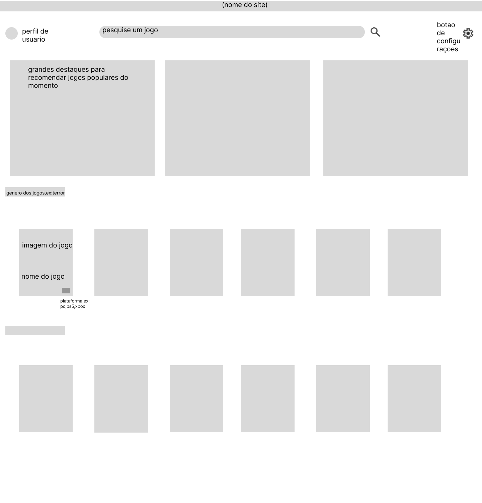

# Trabalho Prático - Semana 04

Dessa vez, vamos escolher uma proposta de projeto para trabalhar.

Nessa atividade, você deverá montar a página inicial do projeto escolhido, a organização do HTML aplicando semântica correta e uso aprimorado do CSS. Leia o enunciado completo no Canvas para mais detalhes.

**IMPORTANTE:** Você deve trabalhar e alterar apenas arquivos dentro da pasta **`public`**. Deixe todos os demais arquivos e pastas desse repositório inalterados. **PRESTE MUITA ATENÇÃO NISSO.**

## Informações Gerais

- Nome: João Pedro Spósito Pereira Cézar 
- Matricula: 912289
- Proposta de projeto escolhida: website de recomendação de jogos
- Breve descrição sobre seu projeto: um website capaz de recomendar jogos de acordo com preferências determinadas, como gênero, estilo, plataforma, etc.

## Print do(s) wireframe(s) criado

## Print da home-page criada

<<  COLOQUE A IMAGEM AQUI >>
